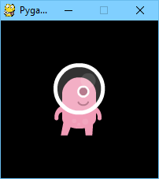

組込みオブジェクト
==================

Pygame Zeroには、ゲーム制作を簡単にしてくれる便利な組込みオブジェクトが用意されています。

.. _screen:

Screen(スクリーン)
------------------

.. toctree::
    :hidden:

    ptext

``screen`` オブジェクトはゲーム・スクリーンを表します。

これは Pygame surface の薄いラッパーで、スクリーンへの描画や画像データの表示を容易にしてくれます。

.. class:: Screen

    .. attribute:: surface

        スクリーン・バッファを表す素の `Pygame surface`_ そのものです。高度なグラフィック操作をしたいときに使用します。

        .. _`Pygame surface`: https://www.pygame.org/docs/ref/surface.html

    .. method:: bounds()

        .. versionadded:: 1.3

        スクリーンの領域を表す ZReact を返します。

    .. method:: clear()

        スクリーンを黒にリセットします。

    .. method:: fill((red, green, blue), [gcolor=(r, g, b)])

        スクリーンを単色で塗り潰します。

        .. versionadded:: 1.3

            ``gcolor`` を指定するとグラデーションを使って塗り潰します。その場合、スクリーンの上端が ``color`` 、下端が ``gcolor`` となります。

    .. method:: blit(image, (left, top))

        指定の位置に画像を描画します。

        ``blit()`` の引数 ``image`` には Surface オブジェクトと文字列、どちらでも指定できます。もし ``image`` が文字列だった場合は、 ``images/`` ディレクトリからその名前の画像を探してロードします。

    .. method:: draw.line(start, end, (r, g, b))

        start の座標から end の座標まで直線を描画します。

    .. method:: draw.circle(pos, radius, (r, g, b))

        円の輪郭を描画します。

    .. method:: draw.filled_circle(pos, radius, (r, g, b))

        塗り潰しで円を描画します。

    .. method:: draw.rect(rect, (r, g, b))

        四角形の輪郭を描画します。

        四角形の領域指定には :ref:`Rect <rect>` を使います。

    .. method:: draw.filled_rect(rect, (r, g, b))

        塗り潰しで四角形を描画します。

    .. method:: draw.text(text, [pos], **kwargs)

        テキストを描画します。

        表示位置やフォーマットを細かに指定できる API もあります(詳細は :doc:`ptext` を参照)。

    .. method:: draw.textbox(text, rect, **kwargs)

        引数に指定された :ref:`Rect` 領域の大きさでテキストを描画します。

        表示位置やフォーマットを細かに指定できる API もあります(詳細は :doc:`ptext` を参照)。

.. _rect:

Rect(四角形の領域指定)
----------------------

`Pygame Rect`_ クラスは組込みのオブジェクトとして利用可能です。このオブジェクトは、スクリーン上のクリックされた領域に四角形を描画するときなど、様々な使い方ができます。

たとえば四角形の描画はこのようにします ::

    RED = 200, 0, 0
    BOX = Rect((20, 20), (100, 100))

    def draw():
        screen.draw.rect(BOX, RED)

.. _`Pygame Rect`: https://www.pygame.org/docs/ref/rect.html

リソースのロード
----------------

``images`` と ``sounds`` オブジェクトはそれぞれ ``images`` と ``sounds`` サブディレクトリに保存されているファイルから、画像とサウンドをロードする際に使われます。Pygame Zero はこれらのリソースを必要に応じて自動的にロードし、何度もロードしなくて済むようにキャッシュします。

通常、画像のファイル名には小文字、数字とアンダースコアだけを使います。また先頭は数字ではなく、文字で始まるようにしてください。

次のようなファイル名ならリソース・ローダは問題なく動作します ::

    alien.png
    alien_hurt.png
    alien_run_7.png

しかし次のような名前だと動きません ::

    3.png
    3degrees.png
    my-cat.png
    sam's dog.png

リソース・ローダーは画像やサウンドをキャッシュします。(たとえばメモリ容量の制限などの理由で)キャッシュをクリアしたいときは、関数 `unload()` や `unload_all()` を使用します。

例 ::

    cow = Actor('cow')
    loader.images.unload('cow')  # キャッシュから cow.png をクリア
    loader.images.unload_all()  # すべての画像キャッシュをクリア

Images
''''''

Pygame Zeroでロード可能な画像の形式は ``.png`` 、 ``.gif`` と ``.jpg`` です。高品質で透過表示をサポートしている PNG の利用をお勧めします。

images ディレクトリは予め作成しておく必要があります。たとえばプロジェクトに次のようなファイルがあるとします ::

    space_game.py
    images/alien.png

この状態で ``space_game.py`` に次のようなコードを書くとスクリーンに alien スプライト描画されます ::

    def draw():
        screen.clear()
        screen.blit('alien', (10, 10))

``blit()`` に渡される名前は images ディレクトリに置かれている画像のファイル名です。ただし拡張子は付けません。

:ref:`actor` APIを使う方法もあります ::

    alien = Actor('alien')

    def draw():
        alien.draw()

上記何れの場合も付けられるファイル名には制限があります。使用できるのは小文字のアルファベット、数字とアンダースコアだけです。これはゲームを動かすオペレーティング・システムによって大文字、小文字の扱いが異なる場合があり、問題が発生することを防ぐためです。

Image Surfaces
''''''''''''''

``images`` ディレクトリに置かれた画像を ``images`` オブジェクトを使ってロードすることもできます。この方法を使うと、画像データそのものを操作したり、サイズを問い合わせることが可能になります ::

    forest = []
    for i in range(5):
        forest.append(
            Actor('tree', topleft=(images.tree.get_width() * i, 0))
        )

ロードした画像は Pygame の ``Surface`` オブジェクトになります。典型的な使い方は
``screen.blit(...)`` でスクリーンに描画することです。このオブジェクトは画像のサイズをピクセル単位で問い合わせできるメソッドを備えています。

.. class:: Surface

    .. method:: get_width()

        画像の幅をピクセル単位で返します。

    .. method:: get_height()

        画像の高さをピクセル単位で返します。

    .. method:: get_size()

        ピクセル単位の画像のサイズを(幅, 高さ)のタプルにして返します。

    .. method:: get_rect()

        画像が原点に位置していた場合、画像の境界のサイズが設定された
	:class:`Rect` を返します。

        これは次のコードと同等の内容です ::

            Rect((0, 0), image.get_size())

Sounds
''''''

Pygame Zeroでロード可能なサウンドの形式は ``.wav`` と ``.ogg`` です。WAV は
サイズの小さな効果音に最適で、圧縮フォーマットの OGG は音楽に適しています。ゲームに使用できる .ogg や .wav ファイルをインターネット上で無償提供しているサイトもあります。

sounds ディレクトリは予め作成しておく必要があります。たとえばプロジェクトに次のようなファイルがあるとします ::

    drum_kit.py
    sounds/drum.wav

``drum_kit.py`` に次の内容を書くと、マウスがクリックときドラムの音を鳴らすようになります ::

    def on_mouse_down():
        sounds.drum.play()

ロードしたサウンドは Pygame の ``Sound`` オブジェクトになります。このオブジェクトは様々なメソッドを備えており、サウンドの再生、停止やサウンドの再生時間の問い合せをサポートしています。

.. class:: Sound

    .. method:: play()

        サウンドを再生します。

    .. method:: play(loops)

        サウンドを指定した回数、繰り返し再生します。

        :param loops: 繰り返し再生する回数。この回数を ``-1`` を指定すると、無限に(もしくは :meth:`.Sound.stop()` で停止するまで)繰り返し再生し続けます。

    .. method:: stop()

        サウンドの再生を停止します。

    .. method:: get_length()

        サウンドの再生時間を秒単位で取得します。

長い音楽を再生するために ``sounds`` オブジェクトを使用することは避けてください。サウンドのシステムは再生前に音楽データをすべてメモリ上にロードするので大量のメモリが必要になることがあり、ロード完了まで遅延が発生する可能性があります。

.. _music:

Music
-----

.. versionadded:: 1.1

.. warning::

    Music API はまだ実験段階のものなので、クロスプラットフォームの移植性問題が発生する可能性があります。

    たとえば

    * Linux ディストリビューションによっては MP3 をサポートしていないものがあります。
    * OGG Vorbis のファイルによっては CPU パワーが 100 パーセント消費されてしまい Pygame がハングしてしまうことがあります。

    後者については、サウンド・データを(できれば別のエンコーダを使って)エンコードし直すことで、解決できる可能性があります。

組込みオブジェクト ``music`` は  ``music/`` ディレクトリに置かれた音楽を再生するための手段を提供します。(``images/`` や ``sounds/`` が存在する場合も並行で利用可能です)

Music を使った場合、音楽データは少しずつロードされるため、 ``sounds`` で長い音楽を再生したときに発生する問題を回避できます。

もうひとつ、サウンドシステムと異なる点は、一度にひとつのトラックしか再生できないことです。もし何か再生中に別のトラックを再生すると、前に再生していたトラックは自動的に停止します。

.. function:: music.play(name)

    指定されたファイルの音楽トラックを再生します。トラックは無限にループ再生されます。

    もし前に再生中のトラックがあればそれを置き換え、 ``queue()`` で待機中のトラックをキャンセルします。

    トラック名にファイルの拡張子を付ける必要はありません。たとえばファイル
    ``handel.mp3`` をループ再生したいときは次のように書きます ::

        music.play('handel')

.. function:: music.play_once(name)

    ``play()`` と同様に音楽を再生しますが、一度再生したら停止します。

.. function:: music.queue(name)

     ``play_once()`` と同様一度だけの再生を意図するものですが、既に再生中のトラックがあってもそれを停止せず、次に再生する曲をキューに入れ、前の曲が完了してから再生します(キュー内にほかのトラックがある場合は、それらがすべて完了してから再生されます)。

.. function:: music.stop()

    音楽の再生を停止します。

.. function:: music.pause()

    音楽の再生を一時停止します。 ``unpause()`` の呼び出しで一時停止は解除できます。

.. function:: music.unpause()

    音楽再生の一時停止を解除します。

.. function:: music.is_playing()

    音楽が再生中でかつ一時停止されていなければ True を返し、それ以外だったら False を返します。

.. function:: music.fadeout(duration)

    フェードアウトして、最終的に現在の音楽再生を停止します。

    :param duration: 音が消えるまでの時間を秒で指定します。たとえば 0.5 秒でフェードアウトしたいなら ``music.fadeout(0.5)`` とします。

.. function:: music.set_volume(volume)

    ミュージック・システムのボリュームを設定します。

    0(無音)から1(最大)までの値を指定できます。

.. function:: music.get_volume()

    現在のミュージック・システムのボリュームを取得します。

:func:`music.play_once()` を使って音楽トラックの再生を開始した場合、  :func:`on_music_end() hook <on_music_end>` を使って再生終了時に何かを実行させることができます。これはたとえば、ランダムに別のトラックを選びたいときなどに有効です。

.. _clock:

Clock
-----

ゲームを作成する場合、時間を遅らせてゲームイベントを発生させたいことがしばしばあります。たとえば 60 秒後に大きなボスのエイリアンを登場させたり、20 秒ごとにパワーアップのアイテムを表示したり、などです。

もっと微妙に、わずかな時間だけアクションを遅らせたいこともあります。たとえば、パワー補充に1秒かかるレーザー兵器とか。

``clock`` オブジェクトを使うと、時間を置いて実行する関数のスケジュールができます。

では、時間を置いて実行したい関数 ``fire_laser`` を定義することから始めましょう ::

    def fire_laser():
        lasers.append(player.pos)

それから発射ボタンが押されると、正確に1秒後にこの関数を呼び出すよう  ``clock`` に依頼します ::

    def on_mouse_down():
        clock.schedule(fire_laser, 1.0)

ここで ``fire_laser`` の後にはカッコを書いていません。関数を実行しているのではなく、関数そのものを渡していることに注意してください。この関数は clock が実行してくれるのです。

(``1.0`` のように小数点付きの秒数で時間を指定するのは良い習慣です。後でコードを読み返したとき、この値が時間であり、物の数ではないことがわかるからです。)

``clock`` は以下の便利なメソッドを提供しています。

.. class:: Clock

    .. method:: schedule(callback, delay)

        指定の時間経過後に `callback` を呼び出すようスケジュールします。

        このメソッドの呼び出しを繰り返すと、コールバックも繰り返しスケジュールされます。

        :param callback: 引数を取らない呼び出し可能オブジェクト。
        :param delay: 関数を呼び出すまでの遅延時間を秒で指定します。

    .. method:: schedule_unique(callback, delay)

        指定の時間経過後に `callback` を一度だけ呼び出すようスケジュールします。

        もし同じ `callback` が既にスケジュールされていたら、一旦それをキャンセルして、スケジュールの再登録が行われます。

        これは複数回スケジュールされた場合にも当てはまります。 ``schedule_unique`` を呼び出した後、で複数回呼び出してもひとつしかスケジュールされません。

        :param callback: 引数を取らない呼び出し可能オブジェクト。
        :param delay: 関数を呼び出すまでの遅延時間を秒で指定します。

    .. method:: schedule_interval(callback, interval)

        `callback` を繰り返し呼び出すようにスケジュールします。

        :param callback: 引数を取らない呼び出し可能オブジェクト。
        :param interval: `callback` を呼び出す間隔を秒で指定します。

    .. method:: unschedule(callback)

        既にスケジュールされているコールバックをキャンセルします。 ``schedule()`` でスケジュールされてまだ呼び出されていなもの、または ``schedule_interval()`` で繰り返しがスケジュールされているものをキャンセルします。

Pygame Zero の clock は指定されたコールバックへの弱参照しか保持しないことに注意してください。オブジェクトとメソッドが他の場所で参照されていない場合、スケジュールされたイベントは発生しません。これは、clock がオブジェクトを生き続けさせ、何らかの理由で他のオブジェクトが消えてしまった後にイベントが発生し続けるのを防ぐのに役立ちます。

弱参照の欠点は、無名関数や他から参照されていないそのスケジュールだけのオブジェクトはスケジュールできないことです。オブジェクトへの参照は保持しておく必要があります。

.. _actor:

Actors
------

ゲーム内で動く画像が多くなってくると、画像とそのスクリーン上の位置をまとめて保持してくれるものがあると便利です。それがスクリーン上の個々の動く画像を管理する ``Actor`` (アクター)です。Actor は(前述の images ディレクトリ内にある)画像ファイル名を指定するだけで生成できます。前にも使ったエイリアンをアクターを使って表示してみます ::

    alien = Actor('alien', (50, 50))

    def draw():
        screen.clear()
        alien.draw()

位置の属性を関数 update の中で変更することで、Actor を動かすことができます ::

    def update():
        if keyboard.left:
            alien.x -= 1
        elif keyboard.right:
            alien.x += 1

また、Actor の属性 image を別の新たな画像名に変更することで、表示中の画像を変更することもできます ::

    alien.image = 'alien_hurt'

Actor は :ref:`Rect <rect>` と同じ属性とメソッドを備えています。そのメソッドのひとつ
 `.colliderect()`__ を使うと二つの Actor が衝突しているかどうかを調べること ができます。

.. __: https://www.pygame.org/docs/ref/rect.html#pygame.Rect.colliderect

Actor の位置指定
''''''''''''''''

位置の属性に新たな値を代入すると、Actor は移動します。たとえば ::

    alien.right = WIDTH

この例ではエイリアンの右端の位置を ``WIDTH`` にしています。

同様に最初の表示位置を Actor のコンストラクタで指定することもできます。使用できるキーワード引数は ``pos``, ``topleft``, ``topright``, ``bottomleft``,
``bottomright``, ``midtop``, ``midleft``, ``midright``, ``midbottom``,
``center`` の何れかです。

.. image:: _static/actor/anchor_points.png

次のようにオブジェクト生成の際や、x と y の座標を指定する方法でも使えます ::

    WIDTH = 200
    HEIGHT = 200

    alien = Actor('alien', center=(100,100))

    def draw():
        screen.clear()
        alien.draw()

``center=(100, 100)`` の部分を ``midbottom=(100, 200)`` に変えると次のようになります。

.. image:: _static/actor/alien_midbottom.png

初期位置を指定しなかった場合, Actor は左上隅(``topleft=(0, 0)`` を指定した場合と同じ)に表示されます.

.. _anchor:

アンカーポイント
''''''''''''''''

Actor には「アンカー(anchor)ポイント」というものがあります。これはシーン内で Actor を配置するときに役立ちます。アンカーポイントのデフォルトは center (中心)です。これにより ``.pos`` も Actor の中心となります(``x`` と ``y`` の座標も同様です). アンカーポイントはスプライトの別の部分(たいてい足)に設定するのが一般的です。そうすることで Actor を何かの上に立たせる設定が可能になります ::

    alien = Actor('alien', anchor=('center', 'bottom'))
    spaceship = Actor('spaceship', anchor=(10, 50))

``anchor`` は ``(x 座標のアンカー, y 座標のアンカー)`` のタプルで指定します。それぞれの値は浮動小数点数または文字列で、文字列の場合 ``left``, ``center``, ``middle``,
``right``, ``top``, ``bottom`` の何れかを適宜指定します。

.. _rotation:

Rotation
''''''''

.. versionadded:: 1.2

``.angle`` はスプライトの回転をコントロールする Actor の属性です。反時計回りで角度を指定します。

回転の中心は Actor の :ref:`アンカーポイント <anchor>` になります。

回転をすると Actor の ``width`` と ``height`` が変わることに注意してください。

次の例は宇宙空間で小惑星がゆっくりと反時計回りに回転するものです ::

    asteroid = Actor('asteroid', center=(300, 300))

    def update():
        asteroid.angle += 1

時計回りに回転させたいときは、  ``update()`` を次のように変更します ::

    def update():
        asteroid.angle -= 1

もうひとつ、次の例は ``ship`` (宇宙船) Actor が正面を常にマウスポインタの方向へ向くようにするものです。マウスポインタが右にある場合 :meth:`~Actor.angle_to()` は 0 を返すため、宇宙船のスプライトも右を向きます ::

    ship = Actor('ship')

    def on_mouse_move(pos):
        ship.angle = ship.angle_to(pos)

.. image:: _static/rotation.svg
    :alt: angle_to() を使ってスプライトを回転させる方法

角度は1回転すると 0 に戻ります。ですから 360 度と 720 度はどちらも 0 度と同じになります。また -180 度は 180 度と同じです。

距離と角度
''''''''''

.. versionadded:: 1.2

Actor には他の Actor や  ``(x, y)`` 形式の座標との距離や角度を計算してくれる便利なメソッドがあります。

.. method:: Actor.distance_to(target)

    この Actor の位置から target までの距離をピクセル数で返します。

.. method:: Actor.angle_to(target)

    この Actor の位置から target までの角度を度で返します。

    このメソッドは -180 度から 180 度までの値を返します。右が 0 度で、反時計回りに数値が増加します。

    したがって次のようになります。

    * 左は 180 度
    * 上は 90 度
    * 下は -90 度

.. _transparency:

透明度
''''''

.. versionadded:: 1.3

場合によって、Actor オブジェクトを部分的に透明にできると便利なことがあります。この手法はフェードイン、フェードアウト表示のほかに、それが「使えない」状態になっていること示すときなどに使われます。

透明度は Actor の ``.opacity`` 属性でコントロールします。

* Actor が完全に不透明の場合、その ``opacity`` は ``1.0`` であり、その背後はまったく見えません。
* Actor が完全に透明の場合、その ``opacity`` は ``0.0`` であり、見えない状態となります。

Actor を幽霊のように半透明にしたいときは、次のようにします ::

    ghost = Actor('ghost')
    ghost.opacity = 0.5

次の図は透明度の尺度を示しています。なお灰色のチェッカーボードは透明感表現するのに使用しています。

.. tip::

    透明なオブジェクトが重なる場合、その描画順は重要です。窓ごしに見える幽霊と幽霊の背後に透けて見える窓はちょっと違いますよね。

キーボード
----------

``keyboard`` については既にこれまでのコードの中に登場していることに気付いていることでしょう。どのキーが押されているのか知りたいときは、組込みオブジェクト ``keyboard`` の属性を調べます。たとえば左矢印キーが押されているときは ``keyboard.left`` が ``True`` になります。それ以外のキーの場合だったら ``False`` になります。

各キーに対応した属性がありますが、その一部を例として紹介します ::

    keyboard.a  # 'A' キー
    keyboard.left  # 左矢印キー
    keyboard.rshift  # 右シフトキー
    keyboard.kp0  # テンキーの '0'
    keyboard.k_0  # メインの '0' キー

すべてのキーの定数は `Buttons and Keys`_ に記されている通りですが、属性は小文字であることに注意してください。キーボードの属性は定数とは違います。

.. deprecated:: 1.1

    大文字で始まる属性名(``keyboard.LEFT`` や ``keyboard.K_a`` など)は廃止になりました。小文字の属性名を使用してください。

.. _`Buttons and Keys`: hooks.html#buttons-and-keys

.. versionadded:: 1.1

    キーの状態はキーボード定数を使っても調べられるようになりました ::

        keyboard[keys.A]  # 'A' キーが押されていたら True
        keyboard[keys.SPACE]  # スペースキーが押されていたら True

アニメーション
--------------

Pygame のたいていのものは、組込みの関数 ``animate()`` を使ってアニメーションにできます。たとえば :ref:`Actor <actor>` を現在の位置から  ``(100, 100)`` へ動かす場合、次のように書きます。

    animate(alien, pos=(100, 100))

.. function:: animate(object, tween='linear', duration=1, on_finished=None, **targets)

    オブジェクトの属性を、現在の値からキーワード引数 target に指定された値までのアニメーションにします。

    :param tween: 使用するアニメーション *トゥイーン* のタイプ。
    :param duration: アニメーションの開始から終了までの時間を秒で指定。
    :param on_finished: アニメーション終了時に呼び出す関数。
    :param targets: アニメーション化する属性のターゲット値。

キーワード引数 tween には以下の何れかの値を指定できます。

+--------------------+------------------------------------------------------------+----------------------------------------+
| 'linear'           | アニメーションの最初から最後まで一定のスピードで動かします | .. image:: images/linear.png           |
+--------------------+------------------------------------------------------------+----------------------------------------+
| 'accelerate'       | ゆっくりしたスピードで始め、だんだん早くします             | .. image:: images/accelerate.png       |
+--------------------+------------------------------------------------------------+----------------------------------------+
| 'decelerate'       | 早いスピードで始め、だんだん遅くします                     | .. image:: images/decelerate.png       |
+--------------------+------------------------------------------------------------+----------------------------------------+
| 'accel_decel'      | アニメーション時間のちょうど中間が一番早くなるようにします | .. image:: images/accel_decel.png      |
+--------------------+------------------------------------------------------------+----------------------------------------+
| 'in_elastic'       | アニメーションの最後に若干の揺らぎを入れます               | .. image:: images/in_elastic.png       |
+--------------------+------------------------------------------------------------+----------------------------------------+
| 'out_elastic'      | アニメーションの最初に若干の揺らぎを入れます               | .. image:: images/out_elastic.png      |
+--------------------+------------------------------------------------------------+----------------------------------------+
| 'in_out_elastic'   | アニメーションの最初と最後に揺らぎを入れます               | .. image:: images/in_out_elastic.png   |
+--------------------+------------------------------------------------------------+----------------------------------------+
| 'bounce_end'       | スピードをだんだん早くして最後に弾みを入れます             | .. image:: images/bounce_end.png       |
+--------------------+------------------------------------------------------------+----------------------------------------+
| 'bounce_start'     | アニメーションの最初に弾みを入れます                       | .. image:: images/bounce_start.png     |
+--------------------+------------------------------------------------------------+----------------------------------------+
| 'bounce_start_end' | アニメーションの最初と最後に弾みを入れます                 | .. image:: images/bounce_start_end.png |
+--------------------+------------------------------------------------------------+----------------------------------------+

関数 ``animate()`` は ``Animation`` のインスタンスを返します。

.. class:: Animation

    .. method:: stop(complete=False)

        アニメーションを停止します。オプションで停止する際の属性値を指定できます。

        :param complete: アニメーションが停止する際の属性値を指定します。

    .. attribute:: running

        このメソッドが True を返したら、アニメーションは動作中です。アニメーションが完了または ``stop()`` メソッドにより停止したときは False を返します。

    .. attribute:: on_finished

        アニメーションが完了したときに呼び出す関数をこの属性にセットできます。 関数 ``animate()`` でキーワード引数 ``on_finished`` を指定した場合も、この属性にその内容が引き継がれます。ただし ``stop()`` で停止したときは、関数は呼び出されません。またこの関数に引数は指定できません。

トーン・ジェネレータ
--------------------

.. versionadded:: 1.2

Pygame Zero 組込みのシンセサイザーを使って音を再生することができます。

.. function:: tone.play(pitch, duration)

    指定された高さと、長さで単音を再生します。

    長さは秒数で指定します。

    `pitch` は周波数の単位ヘルツの値を数値で指定します。

    上記のほか `pitch` を音名で指定する方法もあります。この場合、音名とオクターブの文字列を使います。以下はその例です。

    * ``'E4'`` は第 4 オクターブ E です。
    * ``'A#5'`` は第 5 オクターブの A シャープです。
    * ``'Bb3'`` は第 3 オクターブの B フラットです。

音の生成、特に長い音の生成には時間がかかります(最大で数ミリ秒)。あらかじめ必要な音を生成しておくと、ゲームの実行を遅くせずに済みます。

.. function:: tone.create(pitch, duration)

    Sound オブジェクトを生成して返します。

    再生用のメソッド play() の引数などは前に述べた通りです。

Pygame Zero プログラムの中で次のような使い方をします ::

    beep = tone.create('A3', 0.5)

    def on_mouse_down():
        beep.play()

.. _data_storage:

データ・ストレージ
------------------

``storage`` オブジェクトは PYthon の辞書に似ていますが、その内容はゲーム・セッションを通じて保存されます。ストレージにセットした値は JSON_ 形式で保存されます。したがって保存可能なデータの型は ``list``/``tuple``, ``dict``, ``str``, ``float``/``int``, ``bool``, ``None`` に限られます。

.. _JSON: https://en.wikipedia.org/wiki/JSON

ゲームの ``storage`` の初期状態は空です。したがってプログラムは、ストレージから読み込んだときに、値が何もないことを考慮して作成する必要があります。

ヒントは  ``setdefault()`` を使うことです。これはキーに対応する値が無い場合はデフォルトの値を挿入するようになっています。値があるときは何もしません。

たとえば次のようにして使います ::

    storage.setdefault('highscore', 0)

上記の行が実行されると、 ``storage['highscore']`` に対応する値が存在しなかった場合は値 ``0`` がセットされ、存在したときは何もしません。

他のコードが  ``storage`` を参照する前、 ゲームの冒頭で ``setdefault`` を記述しておくようにしましょう ::

    storage.setdefault('level', 1)
    storage.setdefault('player_name', 'Anonymous')
    storage.setdefault('inventory', [])

そして、ゲームが始まったら値を次のように更新します ::

    if player.colliderect(mushroom):
        score += 5
        if score > storage['highscore']:
            storage['highscore'] = score

ストレージにセットした値はいつでも読み出せます ::

    def draw():
        ...
        screen.draw.text('Highscore: ' + storage['highscore'], ...)

そしてもちろんゲームを終了しても、次に起動したときのために値は保存されます。

``storage`` のメソッドの中でもよく使われるものは以下の通りです。

.. class:: Storage(dict)

    .. method:: storage[key] = value

        値 value をストレージにセットします。

    .. method:: storage[key]

        ストレージから値を取得します。指定した key に対応する値がストレージに無いときは KeyError が発生します。

    .. method:: setdefault(key, default)

        指定した key に対応する値がまだストレージに存在しない場合に限り、 default で指定した値をセットします。

    .. method:: get(key, default=None)

        ストレージから値を取得します。指定した key に対応する値が無い場合、default の指定があればその値を、無ければ None を返します。

    .. method:: clear()

        ストレージの値すべてを削除します。何かおかしくなってやり直したいときは、これを使ってください。

    .. method:: save()

        データを直ちにディスクに保存します。通常このメソッドを呼び出す必要はありませんが、チェックポイントで  ``load()`` を使って再読み込みを実行したいときなどは、その前にこれを呼び出す必要があります。

    .. method:: load()

        保存ファイルからデータをストレージに再読み込みします。これを実行すると、既存のストレージのデータはすべて置き換えられてしまうので注意してください。

    .. attribute:: path

        ストレージ・データの書き込み先ファイルのパスです。

.. caution::

    ゲーム・プログラムを変更すると、 ``storage`` に保存されている値そのままでは正しく動かなくなることがあります。まず間違いがないか確認し、必要があれば ``.clear()`` で一旦すべてのデータをクリア、またはストレージのデータファイルを削除してください。

.. tip::

    ストレージが空のときも、ゲームがちゃんと動くことを確認しておきましょう。

