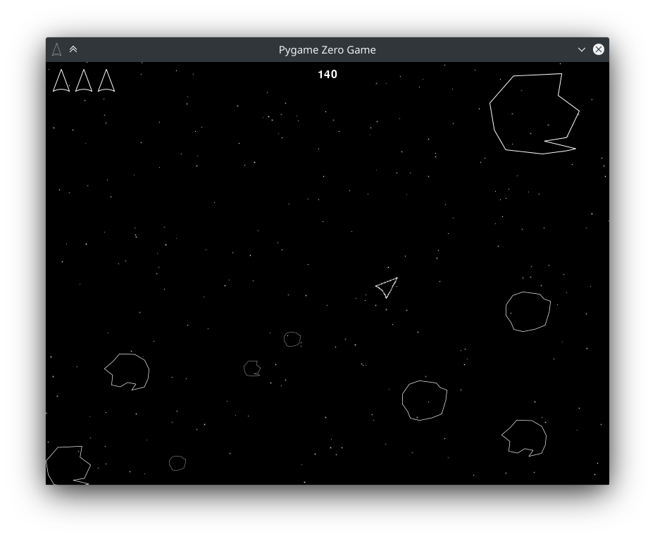
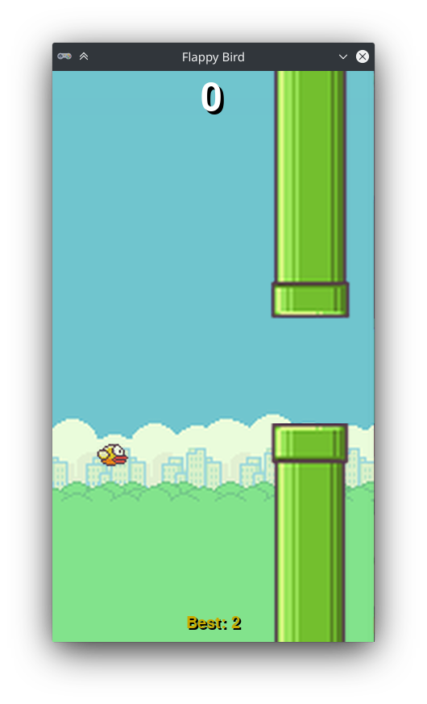
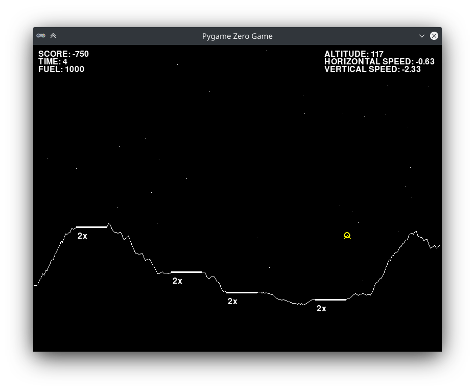
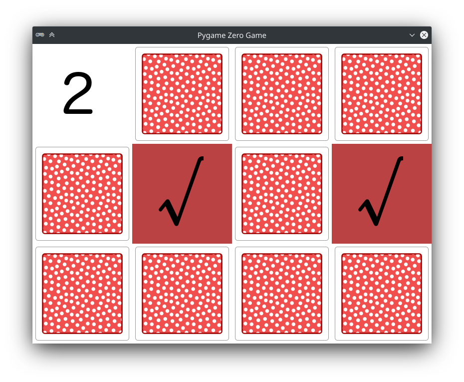
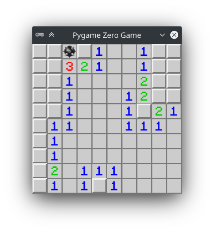
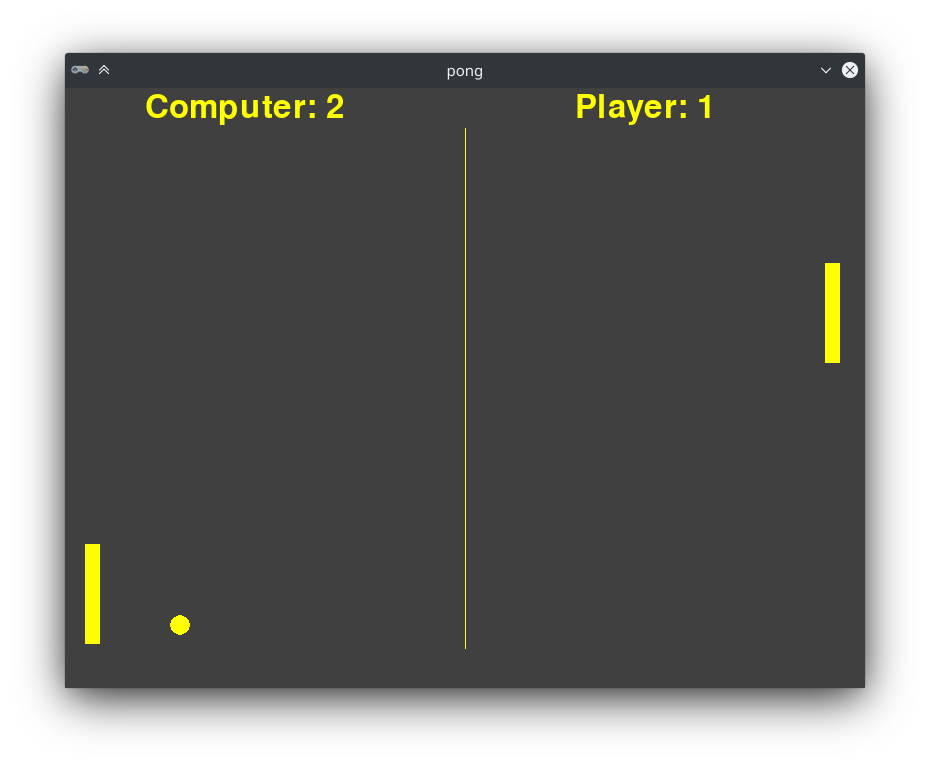
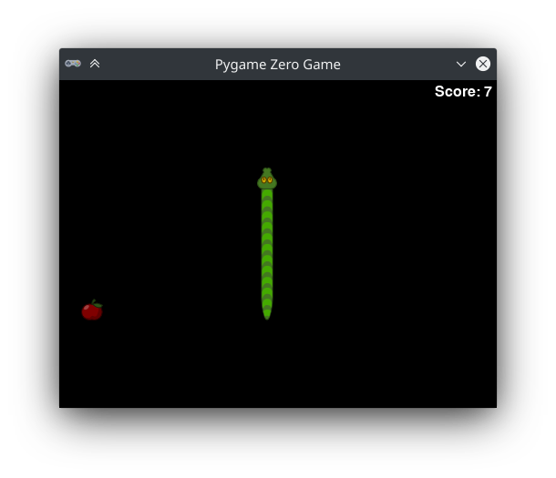
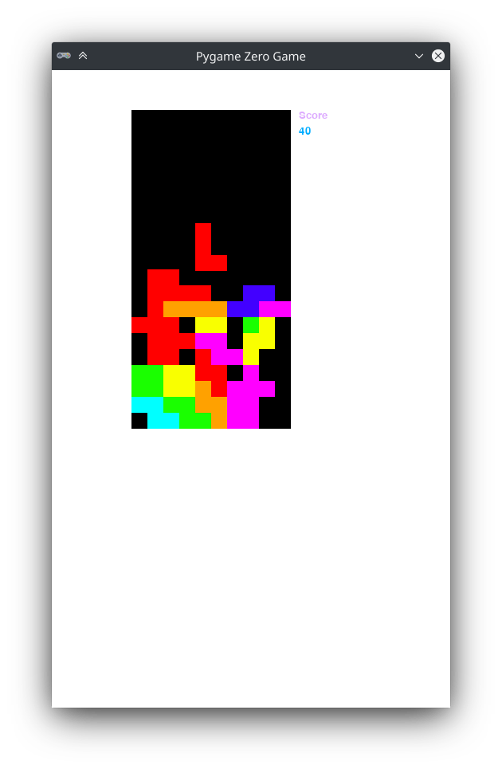
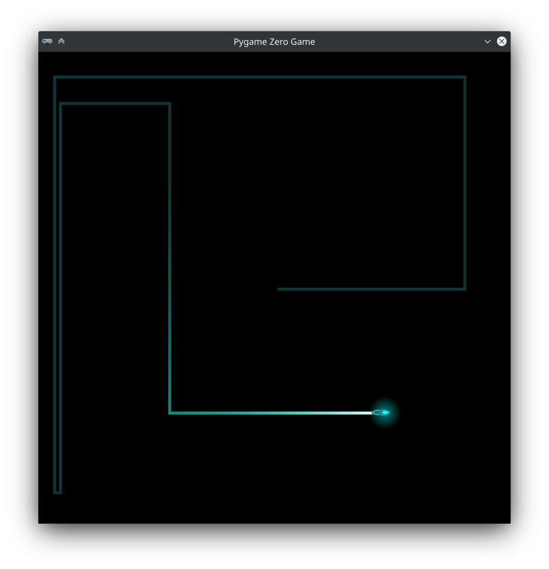

ゲームプログラムのサンプル
==========================

Pygame Zero にはゲームのコードを読んだり変更したりして学ぶためのサンプルのコレクションがあります。もちろんそのゲームで遊ぶこともできます! これらのサンプルは Pygame Zero の通常のインストールでは含まれていませんが、ソースコードリポジトリから入手できます。ダウンロード方法は以下の通りです。

- `GitHub リポジトリ <https://github.com/lordmauve/pgzero>`_ で緑の大きなボタンをクリックすると表示される **Download ZIP** を選択して Pygame Zero をダウンロードします。
- ダウンロードした zip ファイルを展開したら、その中の  ``examples`` をフォルダごと好きな場所にコピーします。
- ディスクスペースを節約したければ、zip ファイルやそのほかのソースコードは削除してかまいません。

これであなたが作成したゲームと同じやり方でゲームを動かせるようになりました。たとえば、ピンポンゲームを起動するには次のように実行してください ::

    pgzrun examples/pong/pong.py

ソースコードを読んだり、変更してみることはプログラミングのとても良い学習方法です。さあ、早速コードをハックしてみましょう!

ゲームサンプルの一覧
--------------------

Asteroids
^^^^^^^^^

実行方法 ::

    pgzrun examples/asteroids/main.py

基本のプログラム
^^^^^^^^^^^^^^^^
以下のプログラムは Pygame Zero の主要機能を学ぶのに役立つ簡単なサンプルです。こららのいくつかはドキュウメントの中で説明されているものです。

Flappybird
^^^^^^^^^^

実行方法 ::

    pgzrun examples/flappybird/flappybird.py

Lander
^^^^^^

   
実行方法 ::

    pgzrun examples/lander/lander.py

Memory
^^^^^^

   
実行方法 ::

    pgzrun examples/memory/memory.py

Mines
^^^^^

   
実行方法 ::

    pgzrun examples/mines/mines.py

Pong
^^^^

   
実行方法 ::

    pgzrun examples/pong/pong.py

Snake
^^^^^

   
実行方法 ::

    pgzrun examples/snake/snake.py

Tetra puzzle
^^^^^^^^^^^^

   
実行方法 ::

    pgzrun examples/tetra_puzzle/main.py

Tron
^^^^

   
実行方法 ::

    pgzrun examples/tron/tron.py
