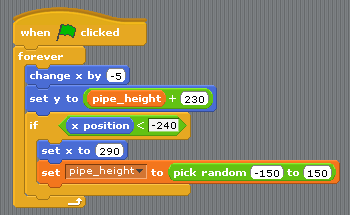

Scratch からの移行
==================

このチュートリアルでは、Scratch で作られた Flappy Bird と Pygame Zero で作られたものを比較してみます。注目していただきたいのは、Scratch と Pygame Zeroのプログラムがよく似ていることです。

`Pygame Zero版`__ はPygame Zero のリポジトリにあります。

.. __: https://github.com/lordmauve/pgzero/blob/master/examples/flappybird/flappybird.py

また `Scratch版`__ も同じリポジトリからダウンロードできます。

.. __: https://github.com/lordmauve/pgzero/raw/master/examples/flappybird/Flappy%20Bird.sb

Pygame Zero 版にはスクロール処理も含まれていますが、Scratch コードとの直接的な対比のため、このページのサンプルからはその部分を除いています。

またサンプルの Pythonコード は例をより分かりやすくするために再構成しています。

ステージ
--------

Scratch 版のステージはこの図のようになっています。

.. image:: _static/scratch/flappybird-stage.png

背景をのぞけば、オブジェクトは三つしかありません。鳥と上のパイプと下のパイプです。

Pygame Zero のプログラムではこの三つのオブジェクトをそれぞれ次のように ``Actor`` として定義します。 ::

   bird = Actor('bird1', (75, 200))
   pipe_top = Actor('top', anchor=('left', 'bottom'))
   pipe_bottom = Actor('bottom', anchor=('left', 'top'))

Pygame Zero ではさらにこれらのオブジェクトの描画を行う必要があります。一方これがシーンの描画処理の書き方に柔軟性を与えてくれます。 ::

   def draw():
       screen.blit('background', (0, 0))
       pipe_top.draw()
       pipe_bottom.draw()
       bird.draw()

パイプを動かす
--------------

2本のパイプは鳥の動きとは無関係に一定のスピードで動きます。パイプはスクリーン左側に消えると、右側から再び現れ、このときパイプの縦の位置はランダムに変わるようになっています。

Scratchでは、上下2本のパイプにそれぞれ異なるスクリプトを設定して、これを実現しています。

.. image:: _static/scratch/flappybird-bottom-start.png

このスクリプトの実行内容は次の通りです。 :

* ``x position < -240`` という条件が成り立つと、パイプがスクリーン左の見えなくなる位置まで来たことを意味します。これがパイプの表示をリセットする合図になります。
* 変数 ``pipe_height`` は2本のパイプの位を置調整するのに使われます。しかしこの値を2つのスクリプトそれぞれでランダムな値をセットしてしまうと、パイプの間の長さを一定に保てません。このため値をセットするスクリプトは片方だけにしています。
* ``set y position to pipe height +/- 230`` の部分でプラスをセットしている方のパイプは ``pipe_height`` より上に、マイナス側は ``pipe_height`` の下に表示されます。

同じ処理を Pygame Zero で書いた場合、もっとシンプルになります。上下両パイプの描画更新処理をひとつの関数にまとめることもできるのですが、わかりやすいように更新とリセットの処理を分けてみました。 ::

   import random

   WIDTH = 400
   HEIGHT = 708
   GAP = 130
   SPEED = 3

   def reset_pipes():
       pipe_gap_y = random.randint(200, HEIGHT - 200)
       pipe_top.pos = (WIDTH, pipe_gap_y - GAP // 2)
       pipe_bottom.pos = (WIDTH, pipe_gap_y + GAP // 2)

   def update_pipes():
       pipe_top.left -= SPEED
       pipe_bottom.left -= SPEED
       if pipe_top.right < 0:
           reset_pipes()

ここで Scratch とやや違っているのは、値を再利用しやすいように、大文字の定数として定義している点です。こうすることで値の定義場所が一カ所にまとまりチューニングしやすくなります。たとえばこのコードだと、2つのパイプの間を広くしたり、狭くしたり変更したいときは ``GAP`` の値を変えるだけで済みます。

一方、大きく違う点は Python コードに ``forever (ずっと)`` のループが無いことです。ここが Scratch とテキストベースの大半のプログラミング言語との大きな違いです。ゲームの更新処理はひとつのアニメーションのステップごとに、すぐにリターンするように作らなければなりません。リターンすることで Pygame Zero は入力を処理したり、スクリーンの再描画など他の処理ができるようになります。ループが終了しないとゲームはその処理から抜けられなくなってしまうので、ほかのループを使う場合もすぐ抜け出るようにしておく必要があります。

Pygame Zero はアニメーション更新のステップの度、関数 ``update()`` を呼び出します。ですからこの関数の中で ``update_pipes()`` を呼び出すだけで OK です。 ::

   def update():
      update_pipes()

鳥
--

前の項で Scratch のロジックを Python コードに変換する方法を説明しました。続いて鳥を動かすロジックも変換してみましょう。今度は最初から Python コードの方を見てみましょう。

鳥の状態を更新するコードは ``update_bird()`` という関数内に記述しています。ここでまず行なっていることは、鳥を重力にしたがって動かすことです。 ::

   GRAVITY = 0.3

   # 鳥の初期状態を設定
   bird.dead = False
   bird.vy = 0

   def update_bird():
       uy = bird.vy
       bird.vy += GRAVITY
       bird.y += bird.vy
       bird.x = 75

以下は重力のシンプルな法則です。

* 重力(Gravity)とは **下方向にはたらく一定の加速度(Acceleration)** です。
* 加速度は **速度(velocity)** を変化させます。
* 速度は **位置(position)** を変化させます。

これを表現するために ``y`` 方向の速度を変数 ``bird.vy`` で保持します。これは新たに定義した変数で、Pygame Zero が元から提供しているものではありません。

* 重力は下方向にはたらく一定の加速度です: つまり ``GRAVITY`` はゼロより大きい。
* 加速度は速度を変化させます:  ``GRAVITY`` から得た値が ``bird.vy`` に加算されます。
* 速度は位置を変化させます: ``bird.vy`` から得た値が ``bird.y`` に加算されます。

鳥が水平方向には動かないことに注意してください! 鳥の ``x`` 座標はゲームを通じて75に固定しています。逆にパイプを鳥に向かって動くようにすることで、鳥が動いているように見せます。そうすることで動いている鳥をカメラが追っているような見た目になります。したがってこのゲームでは変数  ``vx`` を使う必要はありません。

さて、次は鳥を羽ばたかせてみます。 ::

       if not bird.dead:
           if bird.vy < -3:
               bird.image = 'bird2'
           else:
               bird.image = 'bird1'

このコードは鳥が上下どちらに向かっているかをチェックしています。もし上向きの早い速度なら ``bird2`` の画像を表示、それ以外は ``bird1`` を表示するようにしています(-3という値は実際に色々試して意図した通りの動きになる値を導き出しました)。

次の部分では鳥がパイプの壁に衝突していないかをチェックしています ::

       if bird.colliderect(pipe_top) or bird.colliderect(pipe_bottom):
           bird.dead = True
           bird.image = 'birddead'

もし衝突していたら ``bird.dead`` に ``True`` をセットします。これは **ブール値** といって、値は ``True`` か ``False`` の二通りです。この値をチェックすることで、鳥が生きているかどうかを調べられます。もし生きていなければ、プレイヤーの入力には反応しなくなります。

最後の部分では鳥がゲーム・スクリーンの一番下(または一番上)に逹していないかチェックしています。もし逹していたら鳥の位置をリセットします ::

       if not 0 < bird.y < 720:
           bird.y = 200
           bird.dead = False
           bird.vy = 0
           reset_pipes()

ここで ``reset_pipes()`` を呼んでいるのはなぜでしょう？パイプのコードはこの独立した関数内に書かれているため、壁の状態をリセットしたいときは、これを呼び出すだけで済むようになっています。この場合、鳥が最初の状態にポジションに戻ると同時に、壁も初期化されるようにしているのです。

そして前にも説明した通り、これらの処理はフレーム毎に呼び出す必要があります。 ``update()`` に追加しましょう ::

   def update():
      update_pipes()
      update_bird()

最後はプレイヤーの操作に応じて鳥を動かす処理です。何かのキーを押すと、鳥が羽ばたき上昇するようにします。Pygame Zero はキーが押されると ``on_key_down()`` を呼び出すようになっています :: 

   FLAP_VELOCITY = -6.5

   def on_key_down():
       if not bird.dead:
           bird.vy = FLAP_VELOCITY

もし鳥が生きていたら、 ``vy`` にマイナスの値をセットするようにしています。これはPygame Zero の世界で、上へ向かって動かすことを意味します。

Python のコードと次の Scratch のコードをくらべてみると、似た点がたくさん見つかるはずです。

.. image:: _static/scratch/flappybird-bird-space.png

Scratch と Pygame Zero で大きく違う点は次の通りです。

* Pygame Zero では「ずっと」の繰り返しを使う必要はありません。フレーム毎に自動で実行される ``update()`` に更新内容を書いてリターンするだけです。
* 座標の書き方が違います。Pygame Zero ではスクリーンの左上が ``x = 0, y = 0`` になります。``x`` は左から右に移動すると増えていきますが、 ``y`` は上から下に向かって増えていきます。Python のコードで ``GRAVITY`` はプラスの値、 ``FLAP_VELOCITY`` がマイナスの値となっているのはこのためです。
* ``bird.dead`` はブール値です。このため Scratch で ``dead = 0`` のように値を比較していたは ``if not bird.dead`` と書けます。

まとめ
------

Scratch コードでの書き方の多くは、Pygame Zero のコードに直接変換可能です。

いくつかの対応例を記載します。

+-----------------------------------+------------------------------------------------+
| Scratch  コード                   | Pygame Zeroコード                              |
+===================================+================================================+
| ``y を 1 ずつ変える`` (上に移動)  | ``bird.y -= 1``                                |
+-----------------------------------+------------------------------------------------+
| ``y を -1 ずつ変える`` (下に移動) | ``bird.y += 1``                                |
+-----------------------------------+------------------------------------------------+
| ``コスチュームを <name> にする``  | ``bird.image = 'name'``                        |
+-----------------------------------+------------------------------------------------+
| ``もし dead = 0 なら``            | ``if not bird.dead:``                          |
+-----------------------------------+------------------------------------------------+
| ``dead を 0 にする``              | ``bird.dead = False``                          |
+-----------------------------------+------------------------------------------------+
| ``もし Top に触れたなら``         | ``if bird.colliderect(pipe_top)``              |
+-----------------------------------+------------------------------------------------+
| ``旗が押されたとき``...           | 処理内容を関数 ``update()`` に記述する         |
| ``ずっと``                        |                                                |
+-----------------------------------+------------------------------------------------+
| ``どれかのキーが押されたとき``    | ``def on_key_down():``                         |
+-----------------------------------+------------------------------------------------+
| ``a から b までの乱数``           | ``import random`` で ``random`` モジュールを   |
|                                   | ロードして ``random.randint(a, b)`` を実行する |
+-----------------------------------+------------------------------------------------+
| (0, 0) はステージの中心           | (0, 0) はスクリーンの左上隅                    |
|                                   |                                                |
+-----------------------------------+------------------------------------------------+

コードのいくつかの部分では Python の方がよりシンプルになっています。それはコードを読むときに理解しやすいような作りになっているためです。

また Pygame Zero の actor は座標の操作が簡単にできます。たとえば今回パイプの位置指定に  ``anchor`` を使っています。これによってパイプがスクリーンの外に出たかどうかを ``if x position < -240`` ではなく  ``pipe_top.right < 0`` と書けます。

