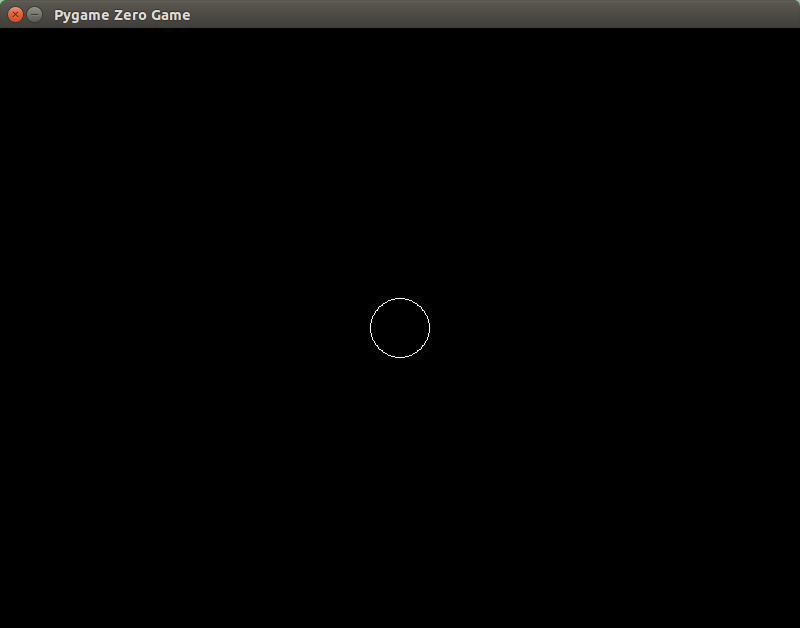

Pygame Zero で始めるプログラミング入門
===================================

では始めましょう。この入門はプログラミング経験の無い初心者が対象です。シンプルだけどおもしろいゲームを作っていきます。

Pygame Zero は既にインストールしてあり、テキストエディタは使えるものとして話を進めていきます。

空っぽのファイルを作る
===================

まず新しいディレクトリを作成し、エディタで fishfrenzy.py という名前の中身は空のファイルを新規に作ります。そのまま何も入力せずに、そのディレクトリの中にfishfrenzy.py という名前で保存してください。

次のようにコマンドを実行して、黒いウィンドウが表示されることを確認してください(the_directory_you_created の部分にはファイルを保存したディレクトリ名を入力します) ::

    cd the_directory_you_created
    pgzrun fishfrenzy.py

実行の方法は使っているエディタやシェル、そのほか色々な条件によって違ってきます。

実行に失敗するときは、指定したディレクトリを間違えている、あるいは Python や
Pygame Zero が正しくインストールされていないなど様々な原因が考えられます。色々な意味でここが最も難しいステップなのです。どの OS を使っているのか、どのバージョンの Python を使っているのか、どのバージョンの Pygame Zero を使っているのかなど、様々な構成があることを考えると、この入門で扱える範囲を越えてしまうのです。

しかし、運が良ければ問題なく動作させることができます。黒い Pygame Zero Game ウィンドウが表示されたら、さらに先に進みましょう。

困ったときは
-----------

チャットの初心者向けチャンネルで助けを求めてみましょう。詳しくは以下のページを読んでください。

https://www.python.jp/pages/pythonjp_discord.html

関数
====

では実際にプログラミングを始めましょう。

ほとんどのプログラミング言語は、**料理のレシピ** のように、コンピュータが実行する一連の手順を定義することでプログラミングします。たとえばケーキ屋さんなら、次のようなレシピがあるかもしれません。

    **ケーキのレシピ**

    * ボウルに小麦粉を入れる
    * ボウルに砂糖を入れる
    * ボウルにバターを入れる
    * ボウルに卵を入れる
    * ボウルに入れた材料を泡立て器でかきまぜる
    * それをケーキの焼き型に入れる
    * オーブンで焼く

... と、こんな感じです(このレシピはそのまま試さないように。ぼくはケーキのことよく知らないので)

プログラマは手順を定義する場合、どんなプログラムになるかをイメージし、嘘の命令を使ってコードを書くことがあります(これを **疑似コード** といいます。プログラムのコードに見えても、実際には動かないためです)。もしケーキのレシピを Python の疑似コードで書くとすれば、次のようなものになるでしょう ::

    def cake_recipe():
        bowl.add(flour)
        bowl.add(sugar)
        bowl.add(butter)
        bowl.add(egg)
        whisk(bowl)
        cake_tin.add(bowl.get_contents())
        bake(cake_tin)

ケーキのレシピに似てますよね？普通の文章とコードの違いはありますが、基本的にはレシピの1行がコードの1行で行う処理にそれぞれ対応しています。

1行目の ``def`` が書かれている行で  ``cake_recipe`` というレシピを定義、その後の行でレシピの各手順を記述しています。また手順の各行に括弧が付いているのは(まだ定義されていない)別のレシピの呼び出しを意味しています。

では Pygame Zero を使って実際にレシピを書いてみましょう。エディタを開いて、
``draw`` レシピを書きます。 Pygame Zero は自動的に関数 ``draw`` を呼び出してくれます ::

    def draw():
        screen.clear()
        screen.draw.circle((400, 300), 30, (255, 255, 255))

次のようにコマンドを入力して実行します ::

    pgzrun fishfrenzy.py

ちゃんと動きましたか？円が表示されたでしょうか？スクリーンには次のように表示されるはずです。

もし Pygame Zero がウィンドウを表示しなかったり、ウィンドウが開いてもすぐに消えてしまうときは、表示されたエラーメッセージを確認しましょう。

* ``SyntaxError`` (文法エラー) - 括弧を閉じ忘れていたり、正しくインデントされていないときなどにこのエラーが出ます。関数内各行のインデントはすべて揃っていなければならず、先頭の  ``def``  よりも深くインデントになっている必要があります。
* ``AttributeError`` (属性エラー) または ``NameError``(名前エラー) - おそらくどこかタイプミスをしています。
* ``TypeError`` (型エラー) - 括弧を間違った場所に付けていませんか？

ウィンドウは開いても何も表示されないならば、"draw" の綴りや数字部分の入力を間違えていないか確認しましょう。

最初、動かなくても少しがんばって調べればうまくいくはずです。

ここで作成したレシピには次の二つの手順が記載されています。

1. スクリーンを何も無い状態にクリアする
2. スクリーンに円を描画する

    * 行の中ほどに書かれた  ``(400, 300)`` 、これは円の中心の座標で、それぞれ左端からのピクセル数、上端からのピクセル数になります。
    * 続く ``30`` は半径のピクセル数です。
    * そして最後の ``(255, 255, 255)`` は表示色の白を意味します。これは三つの数値でそれそれ赤、緑、青を指定しています。赤、緑、青をすべて、指定できる最大の値  ``255`` にしたときの色が白になります。

数値を変更することで円の位置、大きさや色を変えることができます。

ワンポイント: ローカル変数とグローバル変数
-------------------------------------

次のようなコードがあったとします ::

    RED = 150, 0, 0
    GREEN = 0, 128, 0

    bg = RED

    def draw():
        screen.fill(bg)

    def on_mouse_down():
        bg = GREEN

    def on_mouse_up():
        bg = RED

マウスのボタンを押すとスクリーンが緑に変わり、ボタンを離すと赤に戻るように意図したコードです。ほかのプログラミング言語なら、このような書き方をしても意図の通り動くものがあります。

しかし Python では意図したようには動きません。試してみると分かりますが、ボタンを押してもスクリーンは緑に変わりません。なぜでしょう？

10行目から13行目の部分、関数の中で ``=`` を使って代入をしているのですが、ここで作成している ``bg`` は関数の中でのみ有効なローカル変数です。一方、本当に変更したい方の ``bg`` はグローバル変数になっています。実のところ、ちゃんとした理由があってこの区別がされているのですが、最初は分かりにくく感じるかもしれません。

ちゃんと動くようにするには、 ``on_mouse_down()`` と ``on_mouse_up()`` の中で
ローカル変数ではなく、グローバル変数を使うようにします。そのためには
``global`` 宣言文を使用します。正しい Pygame Zero コードは次のようになります ::

    RED = 150, 0, 0
    GREEN = 0, 128, 0

    bg = RED

    def draw():
        screen.fill(bg)

    def on_mouse_down():
        global bg
        bg = GREEN

    def on_mouse_up():
        global bg
        bg = RED
