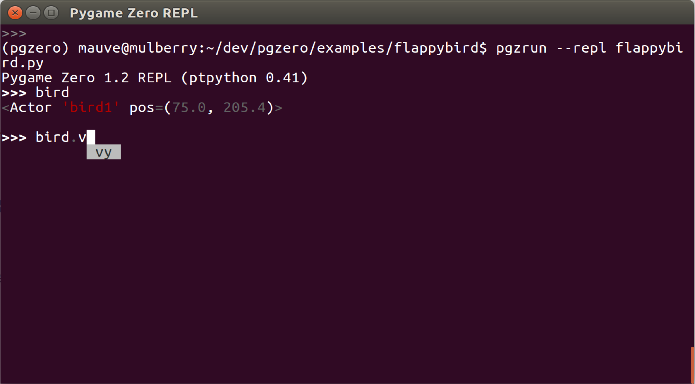

REPL (Read-Evaluate-Print Loop) の使い方
========================================

REPL を使うと、Pygame Zero ゲームを実行しながら Python コマンドで対話的な操作が可能になります。コマンドをタイプすることにより、プログラム中の変数に基づく情報を得ることができます。この機能はやっかいなデバッグやゲーム・チューニング作業をするときに役立ちます。

REPL Read-Evaluate-Print Loop を略した名前です。その意味は

1. **Read (読み取り)** キーボードから入力した内容を読み取ります
2. **Evaluate (評価)** その内容をコードとして評価します
3. **Print (出力)** 評価した結果を出力します
4. **Loop (ループ)** ループバックして1に戻ります

これは Pygame Zero の *オプション機能* です。もしまだインストールされていなければ、 `REPL のインストール`_ をする必要があります。実際に REPL を試してみて、もしインストールされていなければ Pygame Zero はその旨のメッセージを表示して教えてくれます。

.. _`REPL のインストール`: installation.html#install-repl

REPL を使って Pygame Zero のプログラムを動かす
----------------------------------------------

Pygame Zero プログラムをターミナルからコマンドを使って起動する際、
``pgzrun`` に  ``--repl`` オプションを付けてください。たとえばゲーム・プログラムのファイル名が  ``mygame.py`` だとしたら、次のように入力します。 ::

    pgzrun --repl mygame.py

REPL の使い方
-------------

REPL で入力する Python コードは、まるでそれが最初からゲーム・プログラムの中に入力されていたかのように評価されます。

たとえばゲーム・プログラムが次のように書かれていたとします ::

    alien = Actor('alien', pos=(54, 60))

    def draw():
        screen.clear()
        alien.draw()

起動したら REPL で  ``alien`` と入力して alien オブジェクトの内容を見てみましょう ::

    >>> alien
    <Actor 'alien' pos=(54, 60)>

``alien`` オブジェクトの属性に値をセットして、その動きを確認することもできます ::

    >>> alien.x = 90
